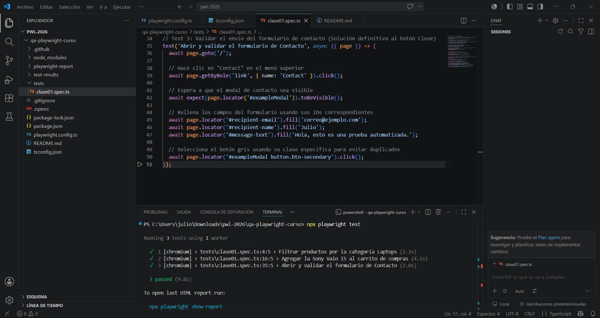
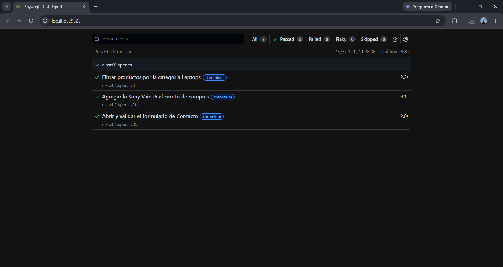
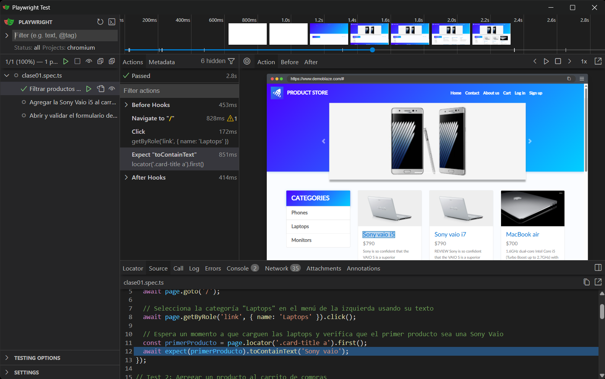
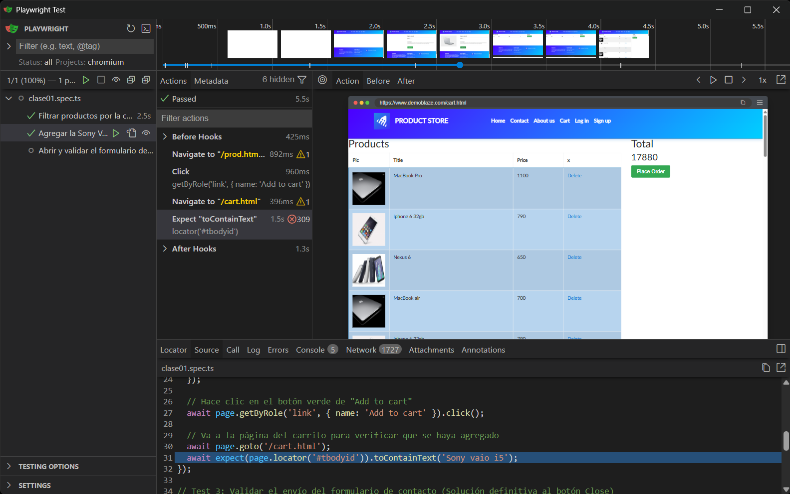
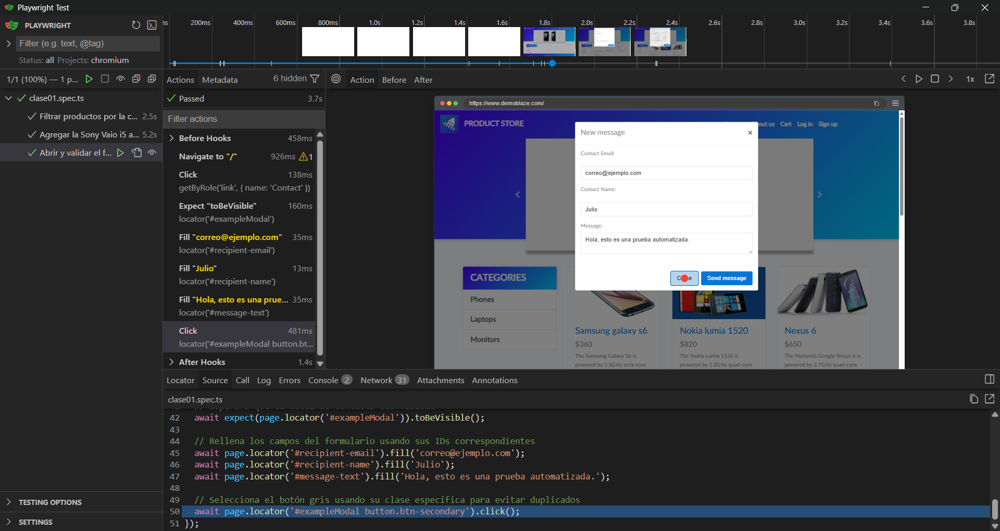

# Entregable - Clase 1: Setup de Playwright 

##  Datos del Estudiante
* **Nombre:** Julio Alberto Hernández Morales
* **Carné:** 1790-22-12000
* **Curso:** Aseguramiento de la Calidad del Software

---

##  Entorno de Desarrollo
* **Node.js:** v24.18.0
* **NPM:** v11.16.0
* **Herramienta de Automatización:** Playwright

---

## 🧪 Pruebas Ejecutadas Correctamente
A continuación se detalla la evidencia de los 3 tests configurados y ejecutándose con éxito en el sistema:

### Evidencia 1: Consola con los tests exitosos

### Evidencia 2

### Evidencia 3

### Evidencia 4

### Evidencia 5

#  Clase 02: Navegación y Esperas en DemoBlaze

###  Archivos de la Clase 2
* **Script de Pruebas:** `tests/clase02.spec.ts`
* **Carpeta de Capturas:** `evidencias/`

## 📝 Reflexión: Auto-wait vs. Sleep() en Playwright

### 1. Auto-wait (Mecanismo Nativo de Playwright)
Playwright implementa un sistema de **esperas automáticas (auto-waiting)** que verifica que los elementos cumplan con ciertas condiciones de accionabilidad (que sean visibles, estables, reciban eventos y estén habilitados) antes de realizar acciones como `.click()`, `.fill()`, etc.

* **Ventajas:**
  * **Pruebas más rápidas y eficientes:** No pierde tiempo esperando de más; la acción se ejecuta en cuanto el elemento está listo.
  * **Pruebas más estables (Menos Flaky Tests):** Reduce fallas por diferencias de latencia de red o velocidad de procesamiento.
  * **Código más limpio y mantenible:** Evita llenar el código de tiempos de espera fijos hardcodeados.

---

### 2. Sleep() / Hard Wait (Pausas Forzadas)
El uso de pausas explícitas o forzadas (como `setTimeout` o `page.waitForTimeout()`) detiene la ejecución del script por un tiempo fijo independientemente de si la página ya cargó o no.

* **Desventajas:**
  * **Ineficiencia:** Si se define una pausa de 5 segundos y el elemento carga en 500ms, se pierden 4.5 segundos inútilmente en cada ejecución.
  * **Fragilidad:** Si el servidor tarda 5.1 segundos debido a lentitud de red, la prueba fallará aunque el selector sea correcto.
  * **Acumulación de tiempos:** En suites de pruebas grandes, el uso de `sleep()` incrementa drásticamente el tiempo total de ejecución.

---

### 💡 Conclusión
El uso de **Auto-wait** y métodos de espera explícitos basados en eventos/selectores (como `page.waitForURL()` o `page.waitForSelector()`) garantiza suites de pruebas ágiles, deterministas y resistentes a variaciones de rendimiento en el entorno de pruebas, superando completamente las prácticas obsoletas de pausas fijas con `sleep()`.
