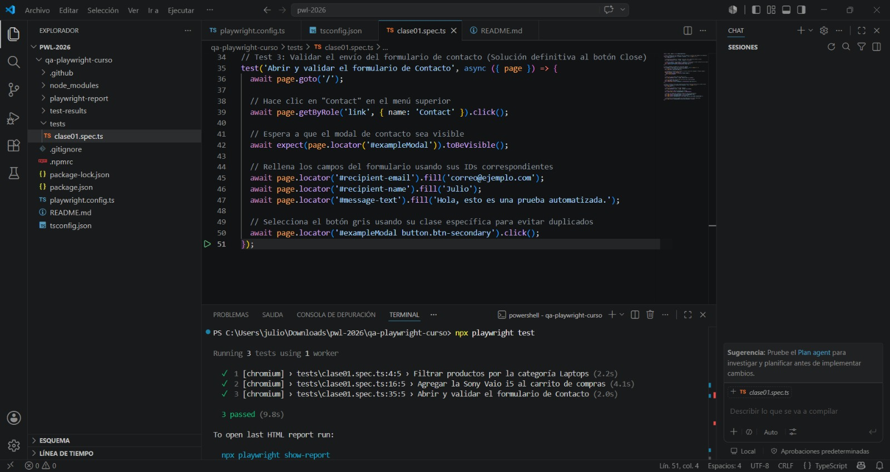
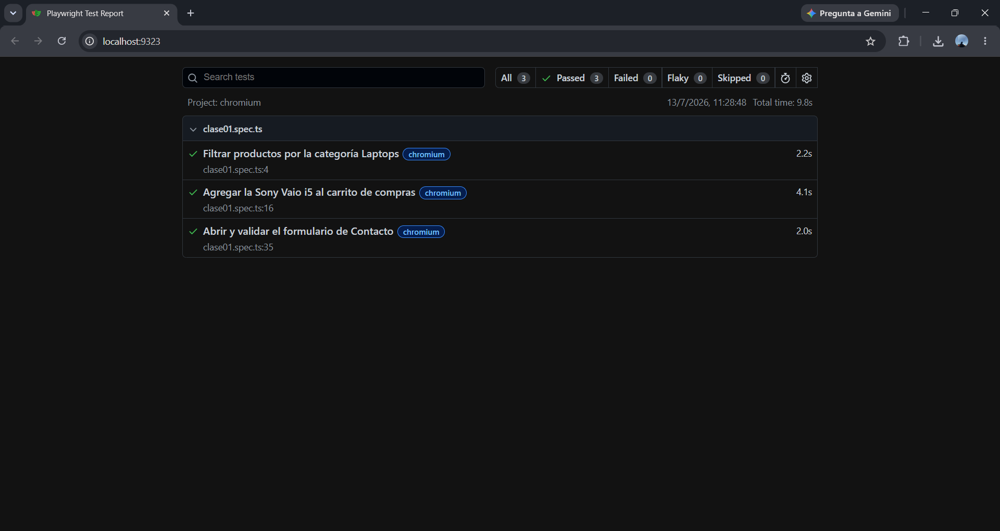
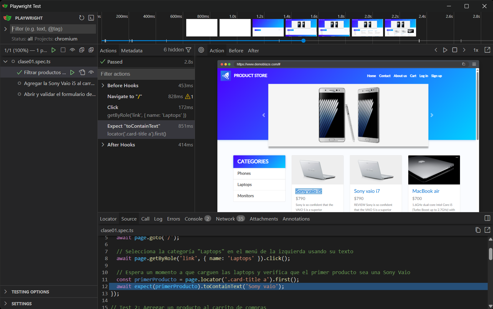
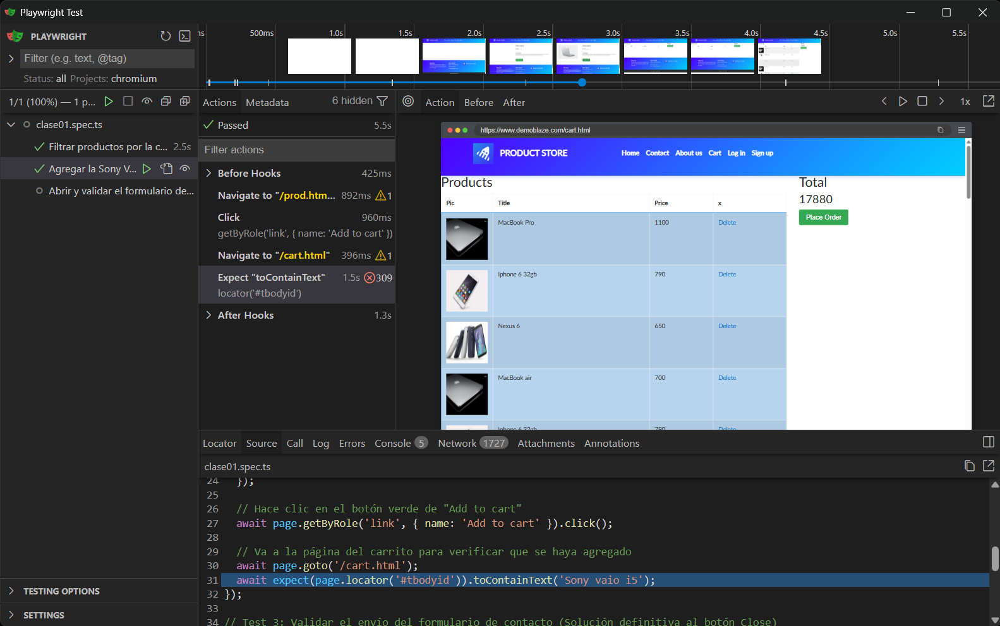
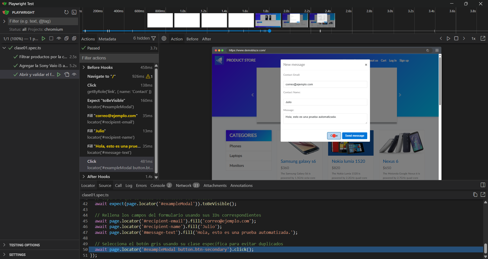

# Entregable - Clase 1: Setup de Playwright 

##  Datos del Estudiante
* **Nombre:** Julio Alberto Hernández Morales
* **Carné:** 1790-22-12000
* **Curso:** Aseguramiento de la Calidad del Software

---

##  Entorno de Desarrollo
* **Node.js:** v24.18.0
* **NPM:** v11.16.0
* **Herramienta de Automatización:** Playwright

---

##  Pruebas Ejecutadas Correctamente
A continuación se detalla la evidencia de los 3 tests configurados y ejecutándose con éxito en el sistema:

### Evidencia 1: Consola con los tests exitosos


### Evidencia 2


### Evidencia 3


### Evidencia 4


### Evidencia 5


#  Clase 02: Navegación y Esperas en DemoBlaze

###  Archivos de la Clase 2
* **Script de Pruebas:** `tests/clase02.spec.ts`
* **Carpeta de Capturas:** `evidencias/`

##  Reflexión: Auto-wait vs. Sleep() en Playwright

### 1. Auto-wait (Mecanismo Nativo de Playwright)
Playwright implementa un sistema de **esperas automáticas (auto-waiting)** que verifica que los elementos cumplan con ciertas condiciones de accionabilidad (que sean visibles, estables, reciban eventos y estén habilitados) antes de realizar acciones como `.click()`, `.fill()`, etc.

* **Ventajas:**
  * **Pruebas más rápidas y eficientes:** No pierde tiempo esperando de más; la acción se ejecuta en cuanto el elemento está listo.
  * **Pruebas más estables (Menos Flaky Tests):** Reduce fallas por diferencias de latencia de red o velocidad de procesamiento.
  * **Código más limpio y mantenible:** Evita llenar el código de tiempos de espera fijos hardcodeados.

---

### 2. Sleep() / Hard Wait (Pausas Forzadas)
El uso de pausas explícitas o forzadas (como `setTimeout` o `page.waitForTimeout()`) detiene la ejecución del script por un tiempo fijo independientemente de si la página ya cargó o no.

* **Desventajas:**
  * **Ineficiencia:** Si se define una pausa de 5 segundos y el elemento carga en 500ms, se pierden 4.5 segundos inútilmente en cada ejecución.
  * **Fragilidad:** Si el servidor tarda 5.1 segundos debido a lentitud de red, la prueba fallará aunque el selector sea correcto.
  * **Acumulación de tiempos:** En suites de pruebas grandes, el uso de `sleep()` incrementa drásticamente el tiempo total de ejecución.

---

###  Conclusión
El uso de **Auto-wait** y métodos de espera explícitos basados en eventos/selectores (como `page.waitForURL()` o `page.waitForSelector()`) garantiza suites de pruebas ágiles, deterministas y resistentes a variaciones de rendimiento en el entorno de pruebas, superando completamente las prácticas obsoletas de pausas fijas con `sleep()`.


---

#  Clase 03: Locators y Casos de Prueba

###  Archivos agregados
* **Pruebas Automatizadas:** `tests/clase03.spec.ts` (6 tests de clase + 3 tests reto)
* **Caso de Prueba Documentado:** `casos-de-prueba/TC-001.md`


---

#  Clase 04: Principios de Pruebas (ISTQB) + Actions en Playwright

###  Archivos agregados
* **Pruebas Automatizadas:** `tests/clase04.spec.ts` (4 tests de clase + 3 tests reto)
* **Evidencias:** `evidencias/clase04/` (capturas de cada test)
* **Reflexión escrita:** `tareas/tarea-04.md` (¿cuál de los 7 principios ISTQB es más importante y por qué?)

---

# Clase 05: Técnicas Tradicionales del Diseño de Pruebas + Assertions

### Archivos agregados
* **Pruebas Automatizadas:** `tests/clase05.spec.ts` (10 tests base + 3 tests reto de la Tarea 05)
* **Tabla de Decisión:** `casos-de-prueba/tabla-decision-checkout.md` (4 condiciones y 6 reglas documentadas)

---

# Clase 06: Testing Estratégico y Ágil + Page Object Model (POM)

### Archivos agregados
* **Carpeta Page Objects:** `pages/` (Contiene `LoginPage.ts`, `InventoryPage.ts`, `CartPage.ts` + 2 nuevos objetos de la Tarea 06)
* **Pruebas Automatizadas:** `tests/clase06.spec.ts` (5 tests base + 3 tests reto, todos pasando correctamente)

### Instrucciones de Ejecución
Para ejecutar únicamente los tests implementados con el patrón POM de esta clase, corre el siguiente comando en la terminal:

```bash
npx playwright test tests/clase06.spec.ts

---
````

# Clase 07: Roles del Equipo QA + Error, Defecto y Fallo + Atributos de Calidad (ISO/IEC 25010)

### Archivos agregados
* **Pruebas Automatizadas:** `tests/clase07.spec.ts` (4 tests de evidencias, todos pasando correctamente)
* **Tests Reto:** `tests/tarea07.spec.ts` (3 tests reto de la Tarea 07 — `test.step()`, `testInfo.attach()` y `toHaveScreenshot()`)
* **Evidencias:** `evidencias/clase07/` (8 capturas: login antes/después, flujo de compra, defecto de usuario bloqueado y comparación de estados)
* **Baseline visual:** `tests/tarea07.spec.ts-snapshots/` (imagen de referencia generada por `toHaveScreenshot()`)
* **Reporte de Defecto:** `reportes/DR-001.md` (defecto simulado documentado con evidencia real del reporte HTML y el Trace Viewer)

### Instrucciones de Ejecución
Para ejecutar los tests de evidencias de esta clase:

```bash
npx playwright test tests/clase07.spec.ts
```

Para ejecutar los 3 tests reto de la Tarea 07:

```bash
npx playwright test tests/tarea07.spec.ts
```

Para revisar el reporte HTML con capturas, video y trace de cada test:

```bash
npx playwright show-report
```
###  Configuración Global de Evidencias (`playwright.config.ts`)
Se configuró el entorno para capturar evidencias automáticas durante la ejecución:
* **Ejecución Visible:** `headless: false` con desaceleración visual de 500ms (`slowMo`).
* **Capturas y Video:** Captura de pantallas (`screenshot: 'on'`) y grabación de video en resolución 1280x720 (`video: 'on'`).
* **Trazabilidad:** Rastreo habilitado (`trace: 'on'`) para análisis detallado post-ejecución.

# Clase 08: Hooks y Suites Avanzadas en Playwright

### Archivos agregados

* **Pruebas Automatizadas:** `tests/clase08.spec.ts` (7 tests, todos pasando correctamente)
* **Tests Reto:** `tests/tarea08.spec.ts` (3 tests reto)
* **Helper de autenticación:** `helpers/auth.ts` (función reutilizable `loginAs()`)
* **Evidencias:** `evidencias/clase08/` y `evidencias/tarea08/`
* **SQA Plan:** `documentos/sqa-plan-saucedemo.md` y evidencia escrita a mano

### Funcionalidades implementadas

* **Hooks:** `beforeEach()` para login automático y `afterEach()` para capturar evidencias de fallos.
* **Suites:** ejecución en modo `parallel` y `serial`.
* **Página compartida:** reutilización de una misma página mediante `beforeAll()`.
* **`test.slow()`:** aplicado al usuario `performance_glitch_user`.
* **`test.skip()` dinámico:** se implementó una condición mediante variable de entorno y se documentó la razón de la omisión.
* **Pruebas:** inventario, precios, imágenes, menú, logout, checkout y comportamiento de diferentes usuarios.
* **SQA Plan:** se documentaron propósito, alcance, herramientas y criterios de salida.

### Instrucciones de Ejecución

Para ejecutar los tests de la clase 08:

```bash
npx playwright test tests/clase08.spec.ts
```

Para ejecutar los 3 tests reto de la Tarea 08:

```bash
npx playwright test tests/tarea08.spec.ts
```

### Evidencia de ejecución

El `test.skip()` dinámico fue comprobado mediante:

```powershell
$env:SKIP_RETO_3="true"; npx playwright test tests/tarea08.spec.ts
```

---

# Clase 09: Automatización de Pruebas + Fixtures y Datos Parametrizados en Playwright

### Archivos agregados
* **Pruebas de Clase:** `tests/clase09.spec.ts` (9 tests base parametrizados ejecutándose en verde)
* **Pruebas del Reto:** `tests/tarea09.spec.ts` (6 tests reto con técnicas avanzadas de fixtures)

### Retos de Fixtures Avanzados Implementados
1. **Reto 1 — Fixture con teardown real:** Implementación de un cronómetro en el setup del fixture, ejecutando el teardown después de `use()` para medir e imprimir la duración total del test (incluso si falla).
2. **Reto 2 — Fixture de alcance worker:** Fixture con `{ scope: 'worker' }` que mantiene el estado persistente (contador incrementando de 1 a 2) entre pruebas ejecutadas por el mismo worker.
3. **Reto 3 — test.use() + parametrización:** Combinación de `test.use({ viewport })` mediante un bucle de iteración para evaluar la prueba en entornos móvil y de escritorio.

### Instrucciones de Ejecución

Los comandos están separados: ejecuta únicamente la clase o únicamente la tarea según lo que quieras revisar.

#### Ejecutar los tests de la Clase 09

```bash
# Ejecutar tests de la clase
npx playwright test tests/clase09.spec.ts --reporter=list
```

#### Ejecutar los tests de la Tarea 09

```bash
# Ejecutar tests de la tarea / retos
npx playwright test tests/tarea09.spec.ts --reporter=list
```

# Clase 10: Pruebas Manuales vs. Automatización + Multi-browser y Tags

### Archivos agregados

- **Configuración multi-browser:** `playwright.config.ts`
- **Pruebas Smoke:** `tests/clase10-smoke.spec.ts`
- **Pruebas Regression:** `tests/clase10-regression.spec.ts`
- **Pruebas de la Tarea 10:** `tests/tarea10.spec.ts`
- **Evidencias:** `evidencias/clase10/` y `evidencias/tarea10/`

### Configuración Multi-browser

Se configuraron 5 proyectos para ejecutar las pruebas en diferentes navegadores y dispositivos:

- Chromium
- Firefox
- WebKit
- Mobile Chrome
- Mobile Safari

---

## 1. Pruebas Smoke

Se implementaron 5 pruebas Smoke para verificar las funcionalidades principales de Sauce Demo:

- Carga de la página de login.
- Login con usuario estándar.
- Visualización de productos en el inventario.
- Acceso al carrito.
- Inicio del proceso de checkout.

### Ejecución

Para ejecutar las pruebas Smoke:

```bash
npx playwright test tests/clase10-smoke.spec.ts
```

---

## 2. Pruebas Regression

Se implementaron 5 pruebas Regression para verificar diferentes funcionalidades del inventario:

- Ordenamiento de productos A-Z.
- Ordenamiento de productos Z-A.
- Ordenamiento de precios de menor a mayor.
- Comportamiento del botón "Add to cart" / "Remove".
- Navegación al detalle del producto y regreso al inventario.

### Ejecución

Para ejecutar las pruebas Regression:

```bash
npx playwright test tests/clase10-regression.spec.ts
```

---

## 3. Tarea 10 - Tests reto

Se implementaron los 3 retos solicitados en la tarea de la Clase 10.

### Reto 1: Tags múltiples + `--grep-invert`

Se utilizaron múltiples tags en los tests para clasificarlos y permitir la selección o exclusión de pruebas mediante los parámetros de Playwright.

Tags utilizados:

- `@regression`
- `@ui`
- `@cart`
- `@soft`
- `@cross-browser`

### Reto 2: `expect.soft()`

Se utilizaron soft assertions para verificar diferentes atributos del primer producto sin detener inmediatamente la ejecución ante el primer fallo.

También se utilizó `testInfo.errors` para consultar los errores acumulados durante las soft assertions.

### Reto 3: Fixture `browserName`

Se utilizó el fixture `browserName` para identificar el motor real del navegador utilizado durante la ejecución.

Se realizaron verificaciones específicas para:

- Chromium
- Firefox
- WebKit

También se verificó funcionalmente el ordenamiento de precios de mayor a menor.

### Ejecución

Para ejecutar los tests de la Tarea 10:

```bash
npx playwright test tests/tarea10.spec.ts
```

## Reporte HTML

Para visualizar el reporte HTML generado por Playwright:

```bash
npx playwright show-report
```

El reporte HTML permite visualizar los resultados de las pruebas, su estado de ejecución y los diferentes proyectos utilizados.
